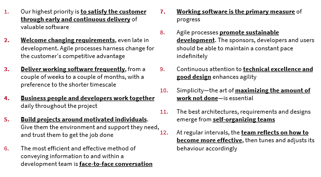

# Agile Scrum

### SCRUM =&#x20;

### Agile

agile represents an overarching philosophy for software development, emphasizing the value of iterating quickly and often to satisfy customers.

&#x20;An agile framework can be defined as a specific software-development approach based on the agile philosophy articulated in the Agile Manifesto

#### Agile Manifesto

### Agile Principles

.png>)

.png>)

### Brief History of Scrum

* In 1993 by Jeff Sutherland&#x20;
* Sutherland and Ken Schwaber, developed Scrum as a formal process in 1995.

.png>)

.png>)

### Scrum Team

.png>)

### Scrum Ceremonies

.png>)

.png>)

### Scrum Artifacts

.png>)

.png>)

### Definition of Done

Let us define “DoD”&#x20;

* Assign deliverables to each team
* &#x20;Each team shall brainstorm and define DoD&#x20;
* Share your outcome&#x20;
* Time boxed 5 minutes

### Key Constraints

* Let us understand limitations/ constraints in following Scrum&#x20;
* Each team discuss, brainstorm and identify at least 5 limitations/ constraints in following Scrum

Some of the Limitations/ Constraints

* &#x20;Configuration Management
* &#x20;Product Integration
* &#x20;Regression Testing&#x20;
* Product Scalability
* &#x20;Technical debt&#x20;
* Design and Code refactoring
