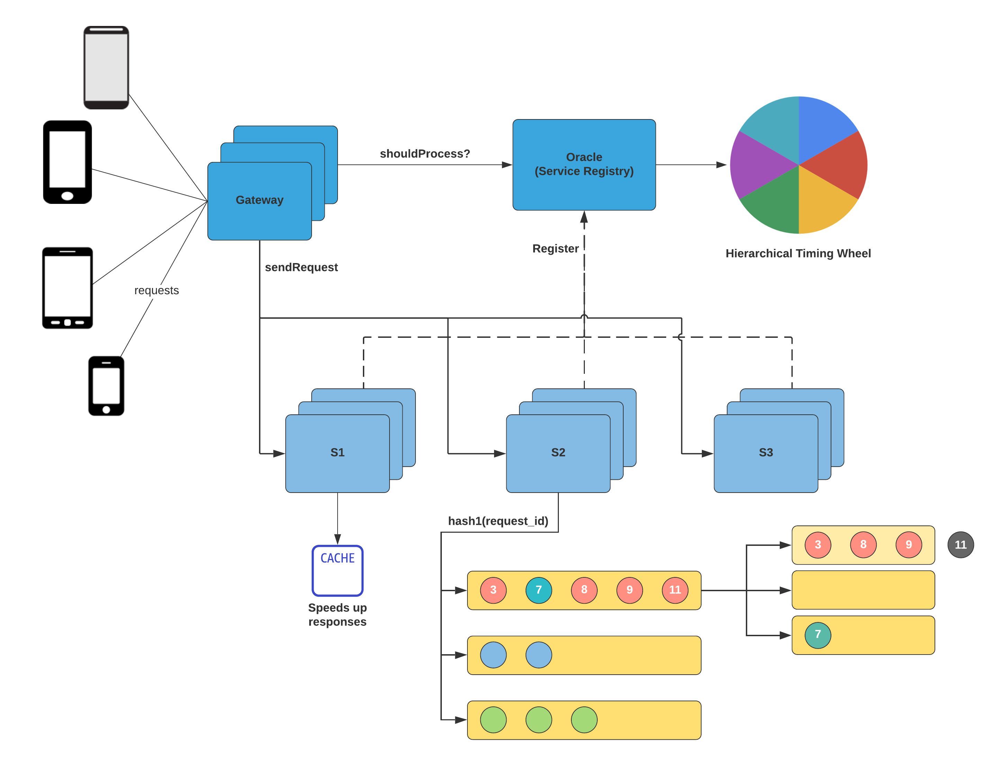

# Distributed Rate Limiting

Assumptions: Number of services: 100 Number of APIs per service: 30 Average request timeout per API: 1 minute Average request size = 1 KB

Questions:

1. How much memory do you need for request allowance in the Oracle?

Assuming each API needs a timer wheel, we shall need buckets proportional to the request timeout per API.

This is 1 minute = 60 seconds = 60 buckets.

Assume an average of 10 requests per second per API.

In total, we have we have (10 \* number of apis) requests.

\= (10 _number of apis per service_ number of services) = (10 _30_ 100) = (30,000)

Every second, we have 30,000 requests. Since we don't need to store the entire request in the oracle, we store only the request ID.

An 8 byte ID can uniquely identify each request. We have a requirement of 8B \* 30,000. = 240 KB.

Since the timer wheel has 60 buckets, we may need 240KB \* 60.

\~ 250KB _60 = 1MB_ 15 = 15 MB

This should easily fit in memory. However, for consistency and fault tolerance, it would be nice to have these records in a DB. (Also note that the oracle is a distributed service)

2\) An API has a timeout of 10 seconds. Each request takes at least 1 second to process. What is the maximum queue wait time?

The request-response flow has three parts = a) Time taken for request to arrive at service. b) Time taken to process the request. c) Time taken for response to arrive at client.

A) Request sent to Server -> B) Request waiting in Queue -> C) Request being processed -> D) Response sent to client

The processing time includes the wait time in the queue.

Assume the travel time to and from the client is 100 ms. That means we have 10 seconds - 200ms = 9800 ms to process each request.

Removing raw processing time, we have 8800 ms. This is the maximum wait time.

1. In the above scenario,​ ​what should be the queue size to allow 1000 requests per second?

We have 1000 requests per second. Assume average length of request is 1 KB. That means we have 1000 \* 1KB per second = 1MB per second.

As the maximum wait time is 8.8 seconds, we need 8.8 s \* 1 MB/s = ​8.8 MB queue size

**1. Is the situation shown at the start of the video the only time we need rate limiting?**

Rate limiting is required for healthy functioning of a system. You might have rate limiting as a business use case (no more than 10 orders a minute) or to reduce lock contention (Imagine a ticket booking system).

Sometimes rate limiting is done to maintain one's SLAs (response times, failure rates, etc...). Rate limiting is also useful, as shown in the start of this video, to avoid a cascading failure.

**2. Is a single rate limiting component used across the entire system? Isn't it a bottleneck and a single point of failure?**

The rate limiter will be a distributed service which can be scaled horizontally. So all common use-cases can be handled here.

But a service might need more custom methods of rate limiting for itself. In that case, it can implement them itself. For example, a chat service might have complicated rate limiting logic and behaviour. This may not be compatible with the other services. In this case, the chat service implements an internal rate limiter.

**3. How do you set the limit for each service?**

Capacity estimation gives us a good number to start.&#x20;

For example, if you have 3 machines with 2 GB RAM and you want them to be caches for 2KB profiles, you can have 3\*2GB/2KB = 3 million profiles in the cache.

If your system has 10 million active users, and 90% can be served by cache, you have an average profile lookup time of 0.9 \* memory\_lookup\_time + 0.1 \* db\_lookup\_time.

That's about 0.9 \* 0.01 ms + 0.1 \* 1 ms = 0.009 + 0.1 ms = 0.11 ms per profile search.

So we should be able to serve 1/0.11 = 9 requests per ms. That's 9000 requests per second.

We then take a conservative estimate of 5000 requests per second for our load tests. After load testing, we can confidently say how many requests our service will be able to handle (with good response times).

**4. Doesn't rate limiting add to the memory requirements and latency of each request?**

Yes, rate limiting is an additional feature which requires design, maintenance and performance tuning. Since the advantages of rate limiting outweigh the drawbacks, it is worth it.

**5. I have heard of terms like back pressure. What is it?**

It's dynamically accepting requests based on how many you have left to process now.

Try this article and other links in the description for a detailed understanding: [https://medium.com/@jayphelps/backpressure-explained-the-flow-of-data-through-software-2350b3e77ce7](https://medium.com/@jayphelps/backpressure-explained-the-flow-of-data-through-software-2350b3e77ce7)

* Time Wheel Java

```
import exceptions.RateLimitExceededException;
import models.Request;
import utils.Timer;

import java.util.Map;
import java.util.concurrent.*;

public class TimerWheel {
    private final int timeOutPeriod;
    private final int capacityPerSlot;
    private final TimeUnit timeUnit;
    private final ArrayBlockingQueue<Request>[] slots;
    private final Map<String, Integer> reverseIndex;
    private final Timer timer;
    private final ExecutorService[] threads;

    public TimerWheel(final TimeUnit timeUnit,
                      final int timeOutPeriod,
                      final int capacityPerSlot,
                      final Timer timer) {
        this.timeUnit = timeUnit;
        this.timeOutPeriod = timeOutPeriod;
        this.capacityPerSlot = capacityPerSlot;
        if (this.timeOutPeriod > 1000) {
            throw new IllegalArgumentException();
        }
        this.slots = new ArrayBlockingQueue[this.timeOutPeriod];
        this.threads = new ExecutorService[this.timeOutPeriod];
        this.reverseIndex = new ConcurrentHashMap<>();
        for (int i = 0; i < slots.length; i++) {
            slots[i] = new ArrayBlockingQueue<>(capacityPerSlot);
            threads[i] = Executors.newSingleThreadExecutor();
        }
        this.timer = timer;
        final long timePerSlot = TimeUnit.MILLISECONDS.convert(1, timeUnit);
        Executors.newSingleThreadScheduledExecutor()
                .scheduleAtFixedRate(this::flushRequests,
                        timePerSlot - (this.timer.getCurrentTimeInMillis() % timePerSlot),
                        timePerSlot, TimeUnit.MILLISECONDS);
    }

    public Future<?> flushRequests() {
        final int currentSlot = getCurrentSlot();
        return threads[currentSlot].submit(() -> {
            for (final Request request : slots[currentSlot]) {
                if (timer.getCurrentTime(timeUnit) - request.getStartTime() >= timeOutPeriod) {
                    slots[currentSlot].remove(request);
                    reverseIndex.remove(request.getRequestId());
                }
            }
        });
    }

    public Future<?> addRequest(final Request request) {
        final int currentSlot = getCurrentSlot();
        return threads[currentSlot].submit(() -> {
            if (slots[currentSlot].size() >= capacityPerSlot) {
                throw new RateLimitExceededException();
            }
            slots[currentSlot].add(request);
            reverseIndex.put(request.getRequestId(), currentSlot);
        });
    }

    public Future<?> evict(final String requestId) {
        final int currentSlot = reverseIndex.get(requestId);
        return threads[currentSlot].submit(() -> {
            slots[currentSlot].remove(new Request(requestId, 0));
            reverseIndex.remove(requestId);
        });
    }

    private int getCurrentSlot() {
        return (int) timer.getCurrentTime(timeUnit) % slots.length;
    }
}


```







###

### Reference

&#x20;Resources:\
[https://www.confluent.io/blog/apache-kafka-purgatory-hierarchical-timing-wheels/](https://www.confluent.io/blog/apache-kafka-purgatory-hierarchical-timing-wheels/)\
[https://aws.amazon.com/builders-library/avoiding-insurmountable-queue-backlogs](https://aws.amazon.com/builders-library/avoiding-insurmountable-queue-backlogs)\
[https://www.facebook.com/zkmeetup/videos/2984998221531756/?t=1469](https://www.facebook.com/zkmeetup/videos/2984998221531756/?t=1469)\
[https://github.com/google/guava/wiki/CachesExplained](https://github.com/google/guava/wiki/CachesExplained)\
[https://community.akamai.com/customers/s/article/How-does-HTTP-2-solve-the-Head-of-Line-blocking-HOL-issue?language=en\_US](https://community.akamai.com/customers/s/article/How-does-HTTP-2-solve-the-Head-of-Line-blocking-HOL-issue?language=en\_US)

