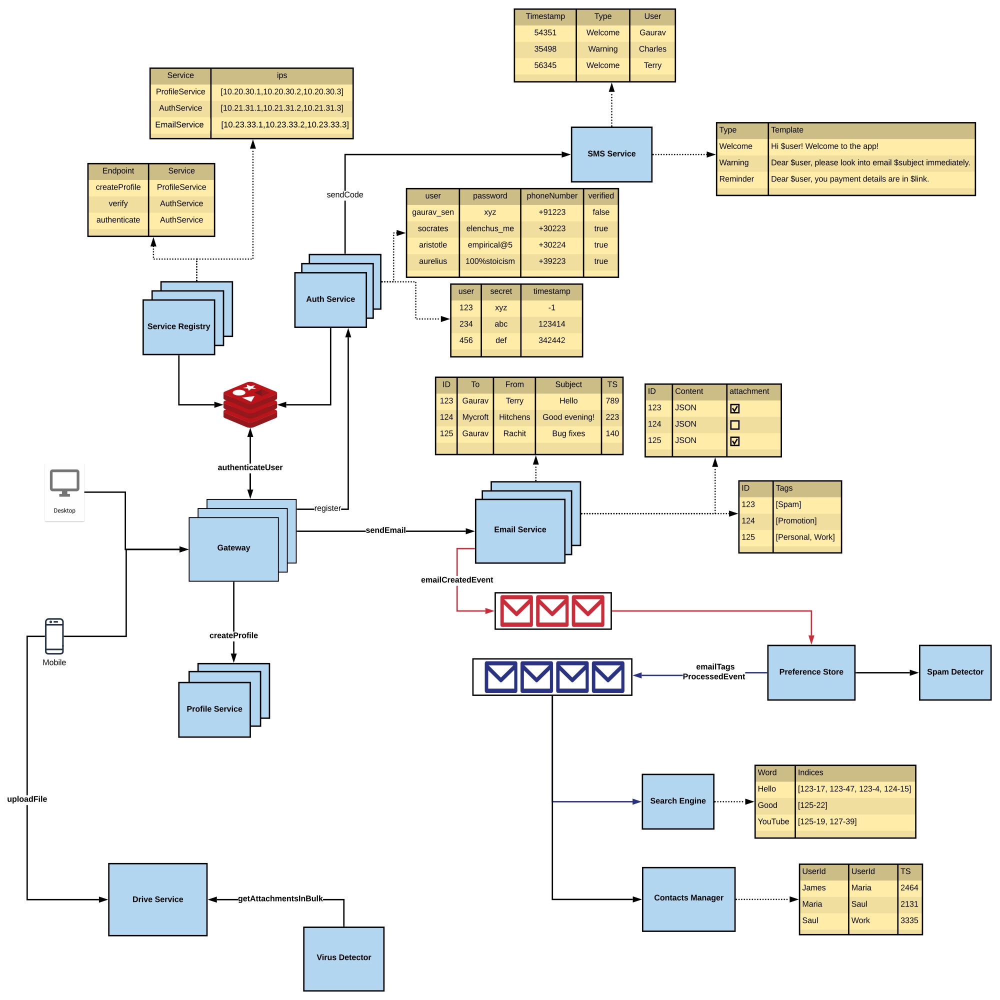

# Gmail System Design

**1. Are we supposed to know the algorithms inside the virus detector and spam filter in an interview?**

_A general idea is good to have. A lot of malware detection algorithms use machine learning. You can talk about what you would do to find malware (monitor a program for resource consumption etc...), in case the interviewer wants to go in detail._

**2. I want to know more about the search engine.**

_You can have a look at Lucene to understand how text search engines work. Since we also need to search on metadata like date and receiver, we will need indexes on those fields._\

**3. Why are we using a separate search engine? Why don't we ask the email service to provide search APIs for the emails?**

_The email service can provide some basic search APIs like search by receiver, date etc… However, complex search queries will require a join across tables, which is expensive._

_If we use a NoSQL database and dump all the denormalised email data into an email table, we can avoid joins. Even then, we would like to have an offline process to reverse index the emails. We would also like to separate the complex search operations from the CRUD operations in the email service._

_Hence, it would be better to separate the two services. A drawback of this could be inconsistencies in the email service and search engine records (The search engine gets the email event after some time)._\
\

**4. What about other features like auto-reply, attachment previews, etc…?**

_In a 45 minute interview, it would be hard to talk about the whole system. Amongst the features you list, you will have to choose those you want to expand upon (choose the most critical features)._&#x20;

__

### _Gmail Capacity_&#x20;

Assumptions: Number of users: 2B Number of devices per user: 2 Number of users opting for 2-step verification: 10% \~ 200M Assume an attachment is on average = 1 MB

Questions:

1. How much storage does gmail need per day to store emails?

Let's say each email has 200 characters, on average. A user receives emails from useful connections, companies and spam. Assume 20 spam emails, 20 marketing emails and 10 useful emails, per user per day.

Email data = Emails _Characters_ Users = 50 _200_ 2B = 20 TB

Attachment data = number of emails with attachments _average attachment size Attachment data = 5% of all emails_ 1 MB Attachment data = 5% _50_ 2B \* 1 MB = 5 PB

So total space requirement is Email data + Attachment data = 20TB + 5 PB per day. This is a naively optimistic estimate, since we must account for redundancy (to improve performance and fault tolerance).

Estimated total space requirement = (20TB + 5 PB ) \* 3 \~ 1​5 PB per day.

However, we can optimise our storage by taking the hash of the contents of each email and storing only one copy. This will avoid repeated entries in the DB for the same email copy. Assuming all marketing and spam mails have just one copy now, the number of emails per person per day goes to 1 + 1 + 10 \~ 15.

Hence, the total space required will reduce proportionately, from 50 to 15 per user. That's 15 \* 15 / 50 = 4​.5 PB

You can further reduce the size using encoding, but mention this with pros and cons. Old emails can be archived and compressed to save space. The newer/frequently accessed ones are better uncompressed and cached.

Assuming compression of 50%, we get 4.5 \* 50% \~ ​2.5 PB per day

2.How much data does gmail need in total to store user profile information?

Assuming 2B users, each having a name, DOB and user email address: Each name is 15 characters on average. DOB: 8 characters. Email address: 20 characters. That's (15 + 8 + 20) \* 2B \~ 100 GB

Let's assume about 10% users have a profile picture. Assuming 100 KB per picture: 2B _100KB_ 10% = 20 TB

Taking redundancy into account, we need (20 TB + 100 GB) \* 3 \~ ​60 TB ​space in total.

3\. How much processing power does the virus detector need to check all attachments?&#x20;

The virus detector needs to run through each attachment uploaded. Total attachments = 5% of all emails _1 MB average size = (1 / 20)_ (15 _2B)_ 1MB = 1​.5 PB everyday

Each attachment has to be scanned, then run through a virus detector. This will require static checks(string matches) and potentially running on a sandbox for tricky viruses. Assuming the time required to be 5 I/O reads, we have =

1.5 PB _(5 I/O Reads) = (1.5_ 10^6 MB) \* (5 I/O reads) Assume each read to take 20 ms per MB.

\= (1.5 _10^9 MB)_ (5 _0.02 seconds per MB) = (1.5_ 10^9 MB) _(0.1 seconds per MB) = 1.5_ 10^8 seconds = 1.5 _10^8 / (24_60_60) days \~ 1.5_ 10^6 / (25 _36) days = 1.5_ 10^6 / (100 _9) days = 1.5_ 10^4 / 9 days \~ 1.5 \* 10^3 = 1500 days

To get 1500 days of work done in 1 day, we need 1500 virus detector processes running in parallel. Assuming we want servers running at 50% capacity and possible spikes in load, we can provision 1500 \* 4 = 6​000 processes.

4\. Similarly, how much processing power does the spam detector need?

Total emails = 15 _2B = 30 billion. Size of each email = 200 bytes. Total email data = 30 billion_ 200 bytes = 6 TB.

Spam detection needs a classifier (example: Bayesian) or a neural network to identify spam. This takes time to run. Assuming time of 5 I/O reads:

\= 6TB _(20ms per MB_ 5) = 6 _10^6MB_ 0.02 seconds per MB _5 = 6_ 10^6 MB _0.1 seconds per MB = 6_ 10^5 seconds = 6 _10^5 / (24_ 60 _60) days = 6_ 10^3 / (24 _6_ 6) days \~ 6 _10^3 / (25_ 36) days = 6 _10^3 / (100_ 9) days = 6 \* 10^1 / 9 days = 60 / 9 days \~ 6 days

We need 6 days of work to be done everyday. This requires 6 processes to be run in parallel. Considering 50% capacity + spikey load, we need 6 \* 4 =​ 24 ​processes in total.

We assume the emails being classified as spam or not spam by a local service. This service will process emails in batch/stream, and persist the results to multiple geographical data centers.

5\. How much contact data should be kept in cache?

Assume 1% of the users to be active at any point in time. We have 2B /100 = 20 million active users.

Each has a contact list. Assume the 'hot' contacts to be the top 10. However, a lot of these hot contacts will be common amongst users. Instead of a fan out, we assume the top 10 to be always from the active users.

These active users will probably be repeated in each other's contact list. If they appear in 10 contact lists, we have 20 million active users / 10 = 2 million unique contacts to be cached. 2 M unique users _profile picture data, if cached = 2M_ 100 KB = 200GB.

If we take 64GB machines, we need at least 200GB/64GB \~ 4 machines.

Taking fault tolerance = 3 and localized processing = 10, we get = 4 \* _3 \*_ 10

\= ​120 machines ​ of 64 GB each.

 (2) (2) (1).png>)

.png>)

.png>)

.png>)



Resources:\
1\) [Message Queues](https://youtu.be/oUJbuFMyBDk)\
2\) [Publisher Subscriber Model](https://youtu.be/FMhbR\_kQeHw)\
3\) [Event Driven Architecture](https://youtu.be/rJHTK2TfZ1I) \
4\) [Fan-out issues](https://youtu.be/QmX2NPkJTKg?t=936) \
5\) [Distributed Caching](https://youtu.be/U3RkDLtS7uY)

&#x20;1\) [API Design](https://youtu.be/\_YlYuNMTCc8)\
2\) Resources mentioned in Part 2.

Links:

* Message Queue: https://youtu.be/oUJbuFMyBDk
* Push vs. Pull Architecture (Instagram video): https://youtu.be/QmX2NPkJTKg?t=935

Side car: [https://akomljen.com/kubernetes-service-mesh/](https://akomljen.com/kubernetes-service-mesh/)

